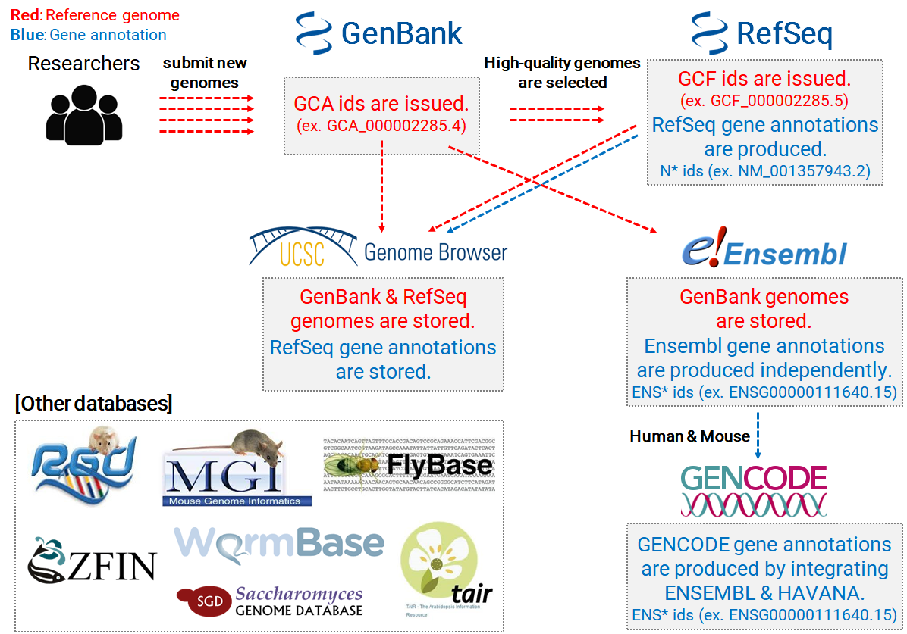
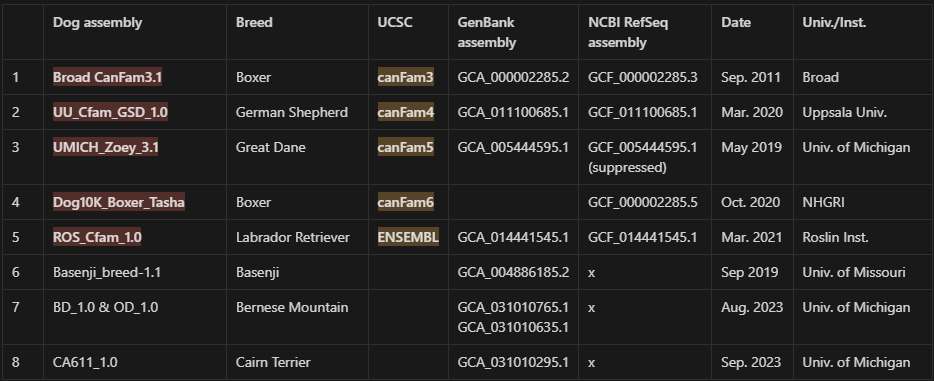
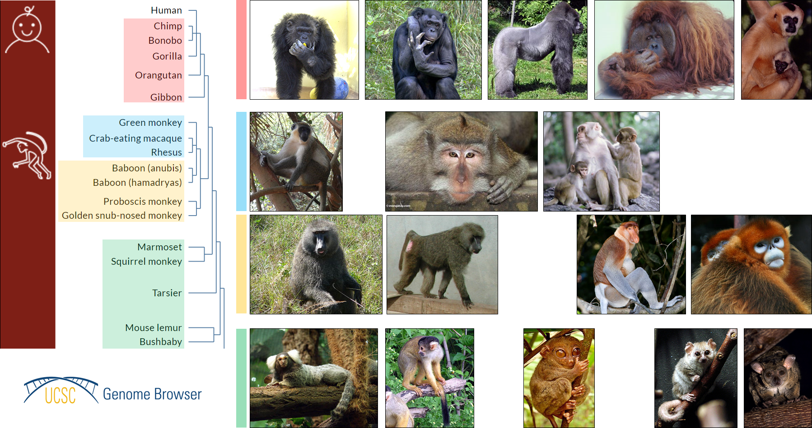

To use the reference genomes and gene annotations for various species rapidly, I record download links in this post.

If you want to know what are the reference genome and gene annotation, and about databases that store these, refer [**this page**]([Accessing genomic reference data | Accessing Public Genomic Data](https://hbctraining.github.io/Accessing_public_genomic_data/lessons/accessing_genome_reference_data.html)).

### Note

<mark>**Chromosome naming conventions**</mark><br>**GENCODE & UCSC**: the prefix "chr" is used before chromosome numbers (e.g., chr1, chr2, chr3) and other chromosome types (e.g., chrX, chrY, chrM for mitochondrial DNA).<br>**Ensembl**: Numbers and letters (e.g., 1, 2, X, Y, MT) are used.<br>This simpler convention is straightforward and reduces the length of chromosome identifiers, which can be advantageous in various computational analyses for efficiency and simplicity.<br>[Readme](https://ftp.ensembl.org/pub/current/fasta/homo_sapiens/dna/README) about reference genome.<br>[Readme](https://ftp.ensembl.org/pub/current/gtf/homo_sapiens/README) about gene annotation.<br>

**GeneBank** (GCA_* id): chromosom ids (e.g., CM*) is used
**RefSeq** (GCF_* id): chromosom ids (e.g., NC_*) is used

### Genome Archive



**UCSC**: [GenArk](https://hgdownload.soe.ucsc.edu/hubs/), [Current Genoms](https://hgdownload.soe.ucsc.edu/goldenPath/currentGenomes/)<br>**NCBI**: [FTP site](https://ftp.ncbi.nlm.nih.gov/genomes/)<br>**Ensembl**: [FTP site](https://ftp.ensembl.org/pub/)<br>**GENCODE** (human & mouse; Ensembl + [HAVANA](https://asia.ensembl.org/info/genome/genebuild/manual_havana.html)): [Website](https://www.gencodegenes.org/)

### Record for downloading

#### Required tools

[**Datasets**](https://www.ncbi.nlm.nih.gov/datasets/docs/v2/download-and-install/) for downloading from NCBI database<br>If you want to use api-key: [NCBI Accounts settings](https://account.ncbi.nlm.nih.gov/settings/)
**I don't recommend this** method because the download speed is too slow, and errors occur frequently.

```bash
curl -o datasets 'https://ftp.ncbi.nlm.nih.gov/pub/datasets/command-line/v2/linux-amd64/datasets'
chmod +x datasets
```

[**twoBitToFa**](https://hgdownload.soe.ucsc.edu/admin/exe/linux.x86_64/) (UCSC Utility) for format conversion from .sra to .fasta

```bash
wget https://hgdownload.soe.ucsc.edu/admin/exe/linux.x86_64/twoBitToFa
chmod +x twoBitToFa
```

#### Functions for downloading

```bash
# Choose the database for downloading
db='ucsc' # ucsc, ensembl


# NCBI database
apikey='' # use personal NCBI api-key
function get_ncbi {
    local accession=$1
    datasets download genome accession $accession \
        --include genome,gtf,seq-report \
        # --api-key $apikey # if use api-key
}

# UCSC database
function get_ucsc {
    local accession=$1
    local ucsc_db="https://hgdownload.soe.ucsc.edu/hubs"
    local address="${ucsc_db}/${accession:0:3}/${accession:4:3}/${accession:7:3}/${accession:10:3}/${accession}/"
    echo $address
    local gtf=$(wget -q -O - ${address}/genes/ |grep 'ncbiRefSeq.gtf.gz' |cut -d '"' -f 2)

    wget -cL ${address}/${accession}.fa.gz # Reference genome
    wget -cL ${address}/genes/${gtf} # Gene annotation
    wget -cL ${address}/${accession}_assembly_report.txt 
}

# ENSEMBL database
function get_ens {
    local species=$1
    local assembly=$2
    if [ -z $3 ]; then
        local latest_version=$(wget -q -O - ftp://ftp.ensembl.org/pub/ |grep 'release' |grep 'current</a>' |awk '{ print substr($0, length($0)-2, 3) }')
        echo "Latest verion (ENSEMBL): $latest_version"
        local version=$latest_version
    else
        local version=$3
    fi
    local ens_db="https://ftp.ensembl.org/pub/release-${version}"
    local fasta=${ens_db}/fasta/${species}/dna/${species^}.${assembly}
    local gtf=${ens_db}/gtf/${species}/${species^}.${assembly}.${version}

    # Download both files
    wget -cL ${fasta}.dna.toplevel.fa.gz # Reference genome
    wget -cL ${gtf}.gtf.gz # Gene annotation

    # Optional files
    # ${fasta}.dna_rm.toplevel.fa.gz # masked genomic DNA.
    # ${fasta}.dna_sm.toplevel.fa.gz # soft-masked genomic DNA.
    # ${gtf}.abinitio.gtf.gz # containing the predicted gene set as generated by Genscan and other abinitio prediction tools.
}

# Download files
function get {
    local accession=$1
    local species=$2
    local assembly=$3
    local version=$4
    if [ $db == "ucsc" ]; then
        get_ucsc $accession
    elif [ $db == "ensembl" ]; then
        get_ens $species $assembly $version
    elif [ $db == "ncbi" ]; then
        get_ncbi $accession
    fi
}
```

```bash
# UCSC database
function get {
    local accession=$1
    local ucsc_db="https://hgdownload.soe.ucsc.edu/hubs"
    local address="${ucsc_db}/${accession:0:3}/${accession:4:3}/${accession:7:3}/${accession:10:3}/${accession}/"
    echo $address
    local gtf=$(wget -q -O - ${address}/genes/ |grep 'ncbiRefSeq.gtf.gz' |cut -d '"' -f 2)
    local report=${accession}_assembly_report.txt    

    wget -cL ${address}/${accession}.fa.gz # Reference genome
    wget -cL ${address}/genes/${gtf} # Gene annotation
    wget -cL ${address}/${report}

    # Change the file & chromosome names
    taxid=$(grep 'Taxid' $report |awk -F': ' '{gsub(/^ +/, "", $2); gsub(/ \(.*\)/, "", $2); gsub(/ /, "_", $2); print $2}')
    asdf=$(grep 'Taxid' $report |awk -F': ' '{gsub(/^ +/, "", $2); gsub(/ \(.*\)/, "", $2); gsub(/ /, "_", $2); print $2}')

}
```

<mark>"suppressed!" means "RefSeq is suppressed!"</mark>

#### Human & Mouse

Human ([Homo sapiens](https://www.ncbi.nlm.nih.gov/datasets/genome/?taxon=9606))<br>Mouse ([Mus musculus](https://www.ncbi.nlm.nih.gov/datasets/genome/?taxon=10090))

```bash

```

#### Pet animals

Dog ([Canis lupus familiaris](https://www.ncbi.nlm.nih.gov/datasets/genome/?taxon=9615))<br>- Others: Dingo ([Canis lupus dingo](https://www.ncbi.nlm.nih.gov/datasets/genome/?taxon=286419)) & Wolf  ([Canis lupus](https://www.ncbi.nlm.nih.gov/datasets/genome/?taxon=9612))<br>Cat ([Felis catus](https://www.ncbi.nlm.nih.gov/datasets/genome/?taxon=9685))



```bash
## Dog ---------------------
# Broad CanFam3.1 / canFam3 (Sep. 2011)
get 'GCF_000002285.3' 'canis_lupus_familiaris' 'CanFam3.1' 104
# UU_Cfam_GSD_1.0 / canFam4 (Mar. 2020)
get 'GCF_011100685.1' 'canis_lupus_familiarisgsd' 'UU_Cfam_GSD_1.0'
# UMICH_Zoey_3.1 / canFam5 / GCA_005444595.1 (May 2019)
get 'GCF_005444595.1' 'canis_lupus_familiarisgreatdane' 'UMICH_Zoey_3.1'
# Dog10K_Boxer_Tasha / canFam6 / GCA_000002285.4 (Oct. 2020)
get 'GCF_000002285.5' 'canis_lupus_familiarisboxer' 'Dog10K_Boxer_Tasha'
# ROS_Cfam_1.0 (Mar. 2021)
get 'GCF_011100685.1' 'canis_lupus_familiaris' 'ROS_Cfam_1.0'

## Basenji_breed-1.1 / GCA_004886185.2 (Aug. 2019)
get 'GCA_004886185.2' 'canis_lupus_familiarisbasenji' 'Basenji_breed-1.1'

## Dog / Dingo
# ASM325472v2 (Sep. 2020)
get 'GCF_003254725.2'
# ASM325472v1 (Jun. 2018) - replaced with ASM325472v2
get 'canis_lupus_dingo' 'ASM325472v1'
GCF_003254725.1, GCA_003254725.1
## Cat ---------------------
# F.catus_Fca126_mat1.0 / GCA_018350175.1 (May 2021)

# Felis_catus_9.0 / felCat9 / GCA_000181335.4 (Nov. 2017) - suppressed!
get_ens 'felis_catus' 'Felis_catus_9.0'
```

#### Farm animals

Pig ([Sus scrofa](https://www.ncbi.nlm.nih.gov/datasets/genome/?taxon=9823))
Cow ([Bos taurus](https://www.ncbi.nlm.nih.gov/datasets/genome/?taxon=9913))
Chicken ([Gallus gallus](https://www.ncbi.nlm.nih.gov/datasets/genome/?taxon=9031))
Horse ([Equus caballus](https://www.ncbi.nlm.nih.gov/datasets/genome/?taxon=9796))
Sheep ([Ovis aries](https://www.ncbi.nlm.nih.gov/datasets/genome/?taxon=9940))
Goat ([Capra hircus](https://www.ncbi.nlm.nih.gov/datasets/genome/?taxon=9925))
Duck ([Anas](https://www.ncbi.nlm.nih.gov/datasets/genome/?taxon=8835))

```bash
## Pig ---------------
# Sscrofa11.1 / susScr11 (Feb. 2017)
get_ens 'sus_scrofa' 'Sscrofa11.1'
# Other breeds
get_ens 'sus_scrofa_usmarc' 'USMARCv1.0' # (Dec. 2017)
get_ens 'sus_scrofa_bamei' 'Bamei_pig_v1' # (Aug. 2016)
get_ens 'sus_scrofa_berkshire' 'Berkshire_pig_v1' # (Aug. 2016)
get_ens 'sus_scrofa_hampshire' 'Hampshire_pig_v1' # (Aug. 2016)
get_ens 'sus_scrofa_jinhua' 'Jinhua_pig_v1' # (Aug. 2016)
get_ens 'sus_scrofa_landrace' 'Landrace_pig_v1' # (Aug. 2016)
get_ens 'sus_scrofa_largewhite' 'Large_White_v1' # (Aug. 2016)
get_ens 'sus_scrofa_meishan' 'Meishan_pig_v1' # (Aug. 2016)
get_ens 'sus_scrofa_pietrain' 'Pietrain_pig_v1' # (Aug. 2016)
get_ens 'sus_scrofa_rongchang' 'Rongchang_pig_v1' # (Aug. 2016)
get_ens 'sus_scrofa_tibetan' 'Tibetan_Pig_v2' # (Aug. 2016)
get_ens 'sus_scrofa_wuzhishan' 'minipig_v1.0' # (Aug. 2016)

## Cow --------------------
# ARS-UCD1.2 > ARS-UCD1.3 / bosTau9 (Apr. 2018 > May 2022)
get_ens 'bos_taurus' 'ARS-UCD1.3'
# UOA_Angus_1 - Bos indicus x Bos taurus (Nov. 2018)
get_ens 'bos_taurus_hybrid' 'UOA_Angus_1'

## Chicken ----------------
# VGP bGalGal1 / GRCg7b (Jan. 2021)
get_ens 'gallus_gallus' 'bGalGal1.mat.broiler.GRCg7b'
# GRCg6a / galGal6 (Mar. 2018)
get_ens 'gallus_gallus' 'GRCg6a' 106

## Horse ------------------
# EquCab3.0 / equCab3 (Jan. 2018)
get_ens 'equus_caballus' 'EquCab3.0'
```

#### Farm plants

Rice ([Oryza sativa](https://www.ncbi.nlm.nih.gov/datasets/genome/?taxon=4530); Asian cultivated rice)
Bread wheat ([Triticum aestivum](https://www.ncbi.nlm.nih.gov/datasets/genome/?taxon=4565))
Durum wheat ([Triticum turgidum subsp. durum](https://www.ncbi.nlm.nih.gov/datasets/genome/?taxon=4567))

```bash
## Rice --------------------

## Wheat -------------------
```

#### Primates



Chimpanzee ([Pan troglodytes](https://www.ncbi.nlm.nih.gov/datasets/genome/?taxon=9598))<br>Bonobo ([Pan paniscus](https://www.ncbi.nlm.nih.gov/datasets/genome/?taxon=9597))<br>Gorilla ([Gorilla gorilla](https://www.ncbi.nlm.nih.gov/datasets/genome/?taxon=9593))<br>Orangutan ([Pongo abelii](https://www.ncbi.nlm.nih.gov/datasets/genome/?taxon=9601))<br>Gibbon ([Nomascus leucogenys](https://www.ncbi.nlm.nih.gov/datasets/genome/?taxon=61853))<br>Green monkey ([Chlorocebus sabaeus](https://www.ncbi.nlm.nih.gov/datasets/genome/?taxon=60711))<br>Cynomolgus monkey; Crab-eating macaque ([Macaca fascicularis](https://www.ncbi.nlm.nih.gov/datasets/genome/?taxon=9541))<br>Rhesus monkey ([Macaca mulatta](https://www.ncbi.nlm.nih.gov/datasets/genome/?taxon=9544))<br>Baboon ([Papio anubis](https://www.ncbi.nlm.nih.gov/datasets/genome/?taxon=9555))<br>Proboscis monkey ([Nasalis larvatus](https://www.ncbi.nlm.nih.gov/datasets/genome/?taxon=43780))<br>Golden snub-nosed monkey ([Rhinopithecus roxellana](https://www.ncbi.nlm.nih.gov/datasets/genome/?taxon=61622))<br>Marmoset ([Callithrix jacchus](https://www.ncbi.nlm.nih.gov/datasets/genome/?taxon=9483))<br>Squirrel monkey ([Saimiri boliviensis boliviensis](https://www.ncbi.nlm.nih.gov/datasets/genome/?taxon=39432))<br>Tarsier ([Carlito syrichta](https://www.ncbi.nlm.nih.gov/datasets/genome/?taxon=1868482))<br>Mouse lemur ([Microcebus murinus](https://www.ncbi.nlm.nih.gov/datasets/genome/?taxon=30608))

```bash
## Chimpanzee (Our closest living relatives, with whom we share a common ancestor from about 5-7 million years ago and approxmately 98-99% of our DNA.)
# NHGRI_mPanTro3-v2.0_pri / GCA_028858775.2 (Jan. 2024)
# Clint_PTRv2 / panTro6 / GCA_002880755.3 (Jan. 2018) - suppressed!
# Pan_tro_3.0 / panTro5 / GCA_000001515.5 (May 2016) - suppressed!
get_ens 'pan_troglodytes' 'Pan_tro_3.0'

## Bonobo (Almost as closely related to humans as chimpanzees, bonobos and chimpanzees are equally close to humans on the evolutionary tree.)
# Mhudiblu_PPA_v0 / panPan3 (May 2020)
# MPI-EVA panpna1.1 / panPan2 (Aug. 2015) - suppressed!
get_ens 'pan_paniscus' 'panpan1.1'

## Gorilla (Shares a common ancestor with humans from about 10 million years ago.)
# Kamilah_GGO_v0 / gorGor6 (Aug. 2019) - suppressed!
# GSMRT3 / gorGor5 (Mar. 2016)
# gorGor4.1 / gorGor4 (Dec. 2014) - suppressed!
get_ens 'gorilla_gorilla' 'gorGor4'

## Orangutan (They are next in line after gorillas.)
# Susie_PABv2 / ponAbe3 (Jan. 2018) - suppressed!
get_ens 'pongo_abelii' 'Susie_PABv2'

## Gibbon
# GGSC Nleu3.0 / nomLeu3 / GCA_000146795.3 (Dec. 2012) - suppressed!
get_ens 'nomascus_leucogenys' 'Nleu_3.0'

## Green monkey
# Chlorocebus_sabeus1.1 / chlSab2 / GCA_000409795.2 (Mar. 2014) - suppressed!
get_ens 'chlorocebus_sabaeus' 'ChlSab1.1'

## Cynomolgus monkey; Crab-eating macaque (Genetically similar to the rhesus monkey and thus relatively far from humans in genetic terms.)
# Macaca_fascicularis_6.0 / GCA_011100615.1 (Mar. 2020)
get_ens 'macaca_fascicularis' 'Macaca_fascicularis_6.0'
# Macaca_fascicularis_5.0 / macFas5 (Jun. 2013)

## Rhesus monkey (More distantly related, with a common ancestor roughly 25 million years ago.)
# Mmul_10 / GCA_003339765.3 (Feb. 2019)
get_ens 'macaca_mulatta' 'Mmul_10'

## Baboon (Baboons are even more distantly related to humans than the macaques.)
# Panubis1.0 / GCA_008728515.1 (Oct. 2019)
get_ens 'papio_anubis' 'Panubis1.0'
# Panu_3.0 / papAnu4 / GCA_000264685.2 (Apr. 2017) - suppressed!

## Proboscis monkey
# Charlie1.0 / nasLar1 / GCA_000772465.1 (Nov. 2014)

## Golden snub-nosed monkey
# Rrox_v1 / rhiRox1 / GCA_000769185.1 (Oct. 2014) - suppressed!
get_ens 'rhinopithecus_roxellana' 'Rrox_v1'

## Marmoset (New World monkeys, and among the least genetically similar to humans of the primates listed.)
# VGP mCalJac1.pat.X / GCA_011100555.1 (Mar. 2020) - replaced with GCA_011100555.2
get_ens 'callithrix_jacchus' 'mCalJac1.pat.X'
# Callithrix_jacchus_cj1700_1.1 / calJac4 GCA_009663435.2 (May 2020) - suppressed!

## Squirrel monkey (Also a New World monkey, and therefore less closely related to humans than the Old World monkeys and apes.)
# Broad SaiBol1.0 / saiBol1 / GCA_000235385.1 (Nov. 2011) - suppressed!
get_ens 'saimiri_boliviensis_boliviensis' 'SaiBol1.0'

## Tarsier
# Tarsius_syrichta-2.0.1 / tarSyr2 / GCA_000164805.2 (Sep. 2013)

## Mouse lemur
# Mmur_3.0 / GCA_000165445.3 (Feb. 2017) - replaced by micMur2 / GCA_000165445.2 (May 2015)
get_ens 'microcebus_murinus' 'Mmur_3.0'
```

#### Experimental models

```bash
 'yeast': '"saccharomyces cerevisiae"[Organism]',
    'fruit fly': '"drosophila melanogaster"[Organism]',
    'nematode': '"caenorhabditis elegans"[Organism]',
    'zebrafish': '"danio rerio"[Organism]',
    'african clawed frog': '"xenopus laevis"[Organism]',
    'rat': '"rattus norvegicus"[Organism]',
    'guinea pig': '"cavia porcellus"[Organism]',
    'rabbit': '"oryctolagus cuniculus"[Organism]',
    # Etc
    'opossum': '"didelphis virginiana"[Organism]'
```

#### Peto's paradox (Long-lived & cancer-free)

```bash
    'elephant': '"loxodonta africana"[Organism]', # 아프리카 코끼리
    'whale': '"balaenoptera musculus"[Organism]', # 흰수염고래
    'naked mole rat': '"heterocephalus glaber"[Organism]',
    'blind mole rat': '"spalax ehrenbergi"[Organism]',
```

### Reference

[2310_GB) GenArk: towards a million UCSC genome browsers](https://genomebiology.biomedcentral.com/articles/10.1186/s13059-023-03057-x)